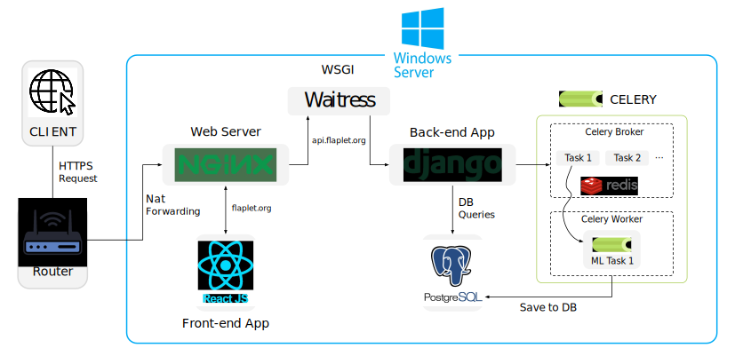
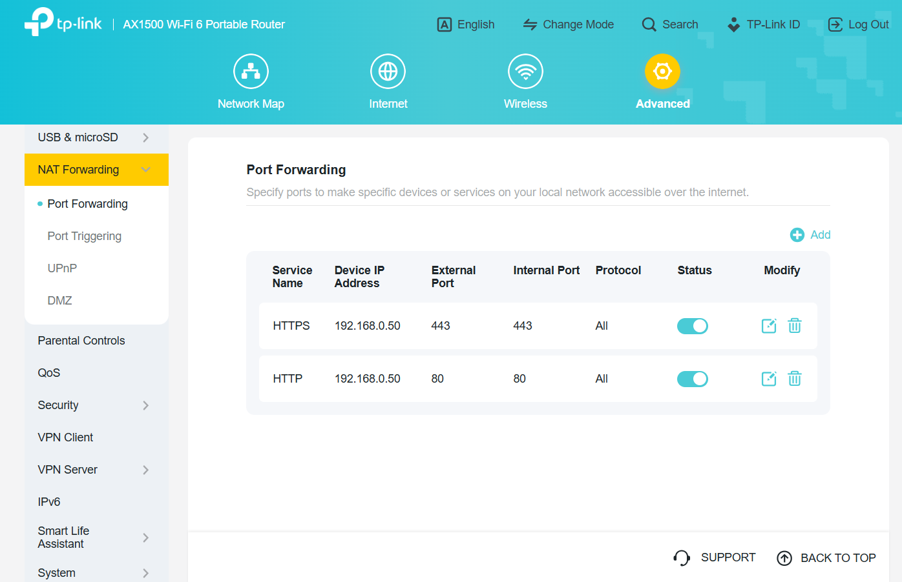
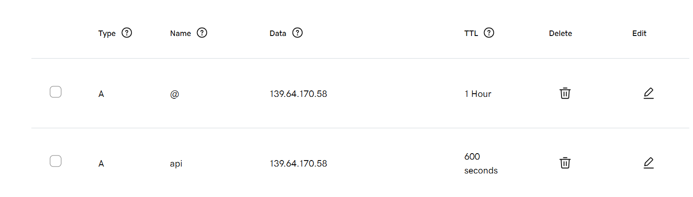

## FlaPLeT: A Full-Stack Web Platform for End-to-End Time Series Data Processing and Machine Learning in Solar Flare Prediction


## 📄 Publication Status

The paper describing this platform is currently under review at *SoftwareX*.

## 📹 Demo Videos

**1. FlaPLeT Architecture Overview**  
This video presents a high-level explanation of the system architecture, including how Django, React, Celery, PostgreSQL, Redis, Nginx, and Waitress work together to support asynchronous machine learning workflows. 

▶️ [Watch on YouTube](https://www.youtube.com/watch?v=g-JB8GZnXdI&t=46s)

**2. FlaPLeT Functionality Demonstration**  
In this video, I log in to the FlaPLeT platform and demonstrate every feature: dataset upload, preprocessing, data augmentation (SMOTE), graph generation, ML training (GRU, SVM, Node2Vec), and downloading reports or models. 

▶️ [Watch on YouTube](https://www.youtube.com/watch?v=gbGtOxnmhVw)


## 🏗️ System Architecture

The platform, *FlaPLeT* (**Fla**re **P**rediction by **Le**arning from **T**ime Series), is a modular web application designed for AI-based multivariate time series (MVTS) analysis and solar flare prediction.

The system architecture includes:

- **Frontend**: Built with React JS and styled using Material UI (MUI), enabling a clean, responsive, and component-based user interface.
- **Backend**: Developed using Django and served with Waitress, the backend handles routing, user sessions, RESTful APIs, and database interactions via Django's ORM.
- **Asynchronous Processing**: Long-running tasks such as preprocessing, augmentation, graph construction, and ML training are managed by Celery with Redis as the message broker.
- **Web Server**: NGINX serves static files, manages HTTPS traffic, and proxies API requests to the backend.
- **Database**: All data, including users, datasets, and results, are stored in a PostgreSQL database, ensuring reliability, transactional integrity, and scalability.

This architecture ensures seamless interaction between components while supporting scalable, real-time AI workflows.




## FlaPLeT Deployment Guide (Windows)

We explain how to set up **FlaPLeT** on a Windows server with a **static IP** mapped to a **domain** (e.g., `flaplet.com`).  
It covers installing prerequisites, cloning the repo, configuring environment variables, running the backend/frontend, Celery workers, and deploying with Nginx.

### 0) Prerequisites

Install the following on Windows:

- **Python** 3.9 – 3.11  
  [Download](https://www.python.org/downloads/)

- **Node.js** 18+ (with npm)  
  [Download](https://nodejs.org/en/download/)

- **PostgreSQL** 13+  
  [Download](https://www.postgresql.org/download/)

- **Redis** (Windows build)  
  [Download](https://github.com/microsoftarchive/redis/releases)

- **Nginx** (Windows build)  
  [Download](https://nginx.org/en/download.html)
  ```
  C:\nginx\           # Nginx installation folder
  ```

- **Git**  
  [Download](https://git-scm.com/downloads)

- **Waitress** (production WSGI server for Django)  
  ```
  pip install waitress
  ```

### 1) Clone the Repository

```
cd C:\
git clone https://github.com/samresume/FlaPLeT.git
```

Folder layout after cloning:
```
C:\nginx\           # Nginx installation folder
C:\FlaPLeT\         # Cloned repo
```

### 2) IP and DNS Configuration

Your server must be reachable on the internet with a **dedicated static IP address**. All incoming HTTP (port 80) and HTTPS (port 443) traffic should be routed to your server.

- If you are deploying on a **local Windows machine** at home or in an office, you need:
  1. An internet connection with a **static IP address** (assigned by your ISP).  
  2. A router configured with **port forwarding** so that external traffic on ports 80 and 443 is forwarded to your computer’s local IP address (e.g., `192.168.0.50`).  

In our case, we configured the router’s **Port Forwarding** rules so that external requests on ports 80 and 443 are forwarded to the local server at `192.168.0.50`.



We also set up DNS records so that our domain `flaplet.org` (for the frontend) and `api.flaplet.org` (for the backend) both point to our static public IP address.  



⚠️ **Important:** If your ISP provides only a **shared IP address** (e.g., behind Carrier-Grade NAT), inbound requests from the internet cannot reach your network. To host a public-facing service, you must obtain a **dedicated static IP** from your ISP.


### 3) Frontend (React)

cd C:\FlaPLeT\frontend
npm install
npm run build

The compiled site will be in: C:\FlaPLeT\frontend\build\

### 4) Backend (Django)

cd C:\FlaPLeT\backend
py -m venv venv
Set-ExecutionPolicy Unrestricted -Scope Process
.\venv\Scripts\activate
pip install -r requirements.txt

python manage.py migrate
python manage.py createsuperuser
python manage.py collectstatic --noinput

### 5) Nginx Configuration


### 2) Configure Backend Environment

Ensure .env (C:\FlaPLeT\backend\.env) has the following keys (replace values as needed):

DJANGO_SECRET_KEY=***your-secret***
DJANGO_DEBUG=False
ALLOWED_HOSTS=flaplet.example.com,localhost,127.0.0.1

DATABASE_URL=postgres://<DB_USER>:<DB_PASS>@127.0.0.1:5432/<DB_NAME>

REDIS_URL=redis://127.0.0.1:6379/0
CELERY_BROKER_URL=redis://127.0.0.1:6379/0
CELERY_RESULT_BACKEND=redis://127.0.0.1:6379/1

STATIC_ROOT=C:\FlaPLeT\static\
MEDIA_ROOT=C:\FlaPLeT\media\

CSRF_TRUSTED_ORIGINS=https://flaplet.example.com


## 🚀 Platform Features

The platform provides an end-to-end environment for working with multivariate time series (MVTS) data, tailored for solar flare prediction. It supports data upload, preprocessing, augmentation, graph-based transformation, and machine learning classification, all through an interactive web interface.

### 1. Dataset Upload & Preprocessing
- Upload `.pkl`-format MVTS datasets (up to 25MB).
- Missing value handling: mean imputation or sample removal.
- Normalization options: z-score or min-max scaling.
- Output: Processed dataset and downloadable summary report (data shape, label distribution, normalization stats).

### 2. Data Augmentation
- Supports **SMOTE** and **TimeGAN** techniques.
- Configurable parameters:
  - SMOTE: `k_neighbors`
  - TimeGAN: `batch_size`, `num_layers`, `iteration`
- Output: Augmented dataset and detailed report (class distribution before/after, technique used, runtime).

### 3. Functional Network Generation
- Constructs graph-based datasets via Pearson correlation analysis.
- User-defined correlation threshold and max neighbors.
- Output: Graph (`.gpickle`), labels, and report (nodes, edges, label stats).

### 4. Machine Learning Classification
- **GRU** (for MVTS): customizable layers, hidden size, dropout, learning rate, batch size, epochs, and optimizer (`Adam`, `SGD`).
- **SVM** (for MVTS): kernel selection and regularization strength.
- **Node2Vec + Logistic Regression** (for graph data): embedding dimensions, walk length, window size, batch size, regularization penalty, solver, and iteration count.
- Output: Trained model and evaluation report (Accuracy, Precision, Recall, AUC, TSS, HSS, GS).

### 5. Task Management & Reporting
- All tasks run asynchronously and are tracked by status (`running`, `completed`, `failed`).
- Users can view task metadata, download results, and manage completed tasks.


## 📑 Project Funding

This platform was developed as part of a research effort supported by the **National Science Foundation (NSF)** under the **Office of Advanced Cyberinfrastructure (OAC)**, aimed at providing researchers with seamless access to time series data preprocessing, augmentation, and machine learning workflows through a user-friendly web interface.

- **Recipient Institution**: Utah State University  
- **Award Number**: [2305781](https://www.nsf.gov/awardsearch/showAward?AWD_ID=2305781&HistoricalAwards=false)  
- **Project Title**: *CRII: OAC: Cyberinfrastructure for Machine Learning on Multivariate Time Series Data and Functional Networks*  
- **Award Period**: October 1, 2022 – May 31, 2025 (estimated)  
- **Total Award Amount**: $174,984.00

  
## 🤝 Collaboration & Contact

If you're working on a similar AI-based web application and are looking for guidance, collaboration, or have any questions, feel free to reach out.

📧 **Contact**: Sam EskandariNasab  
✉️ **Email**: [sameskandarinasab@gmail.com](mailto:sameskandarinasab@gmail.com)

## License

This project is licensed under the MIT License.
